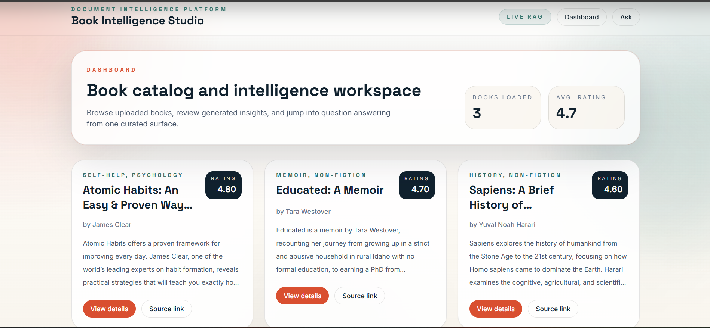
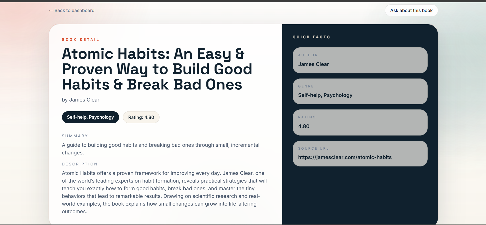
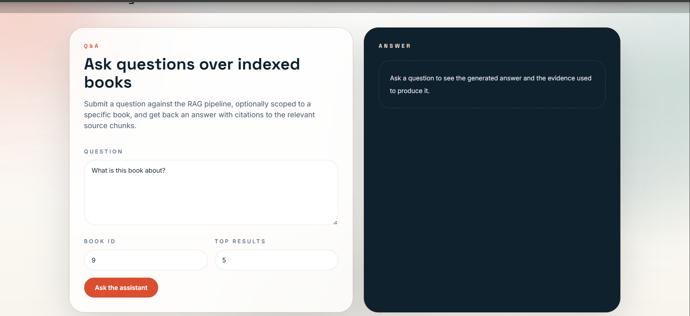
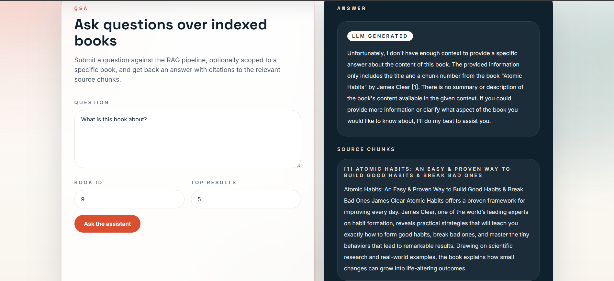

# Document Intelligence Platform

A full-stack Django + React application for scraping book data, storing metadata, generating AI insights, and answering questions through a retrieval-augmented generation pipeline.

---

## 1. Screenshots of the UI

### Dashboard Overview


### Book Detail View


### Q&A Input Page


### Q&A Answer Page


---

## 2. Setup Instructions

### Backend

1. Create and activate a Python virtual environment.
2. Install dependencies:
   ```bash
   cd backend
   ..\.venv-cpython310\Scripts\python.exe -m pip install -r ..\requirements.txt
   ```
3. Create a `.env` file in `backend/` from `.env.example`.
4. Run migrations:
   ```bash
   ..\.venv-cpython310\Scripts\python.exe manage.py migrate
   ```
5. Start the API server:
   ```bash
   ..\.venv-cpython310\Scripts\python.exe manage.py runserver
   ```

### Frontend

1. Install frontend dependencies:
   ```bash
   cd frontend
   npm install
   ```
2. Start the app:
   ```bash
   npm run dev
   ```
3. If the frontend is not using the default backend URL, set:
   ```bash
   VITE_API_BASE_URL=http://localhost:8000
   ```

---

## 3. API Documentation

### Books

- `GET /api/books/` - List all uploaded books
- `GET /api/books/<id>/` - Fetch full book details
- `GET /api/books/<id>/related/` - Recommend related books
- `POST /api/books/upload-book/` - Upload a book from JSON

### RAG

- `POST /ask/` - Ask a question over the indexed book corpus


### Example Books

#### Book 1: Sapiens: A Brief History of Humankind
* **Title:** Sapiens: A Brief History of Humankind
* **Author:** Yuval Noah Harari
* **Description:**
  Sapiens explores the history of humankind from the Stone Age to the 21st century, focusing on how Homo sapiens came to dominate the Earth. Harari examines the cognitive, agricultural, and scientific revolutions, and how these shaped societies, cultures, and the world as we know it. The book challenges readers to consider the ways in which biology, anthropology, and economics have influenced human history, and what the future may hold for our species.
* **Summary:**
  A sweeping narrative of human history, Sapiens explains how our species evolved, organized societies, and created the modern world.
* **Genre:** History, Non-fiction
* **Rating:** 4.6
* **URL:** https://www.harpercollins.com/products/sapiens-yuval-noah-harari

#### Book 2: Educated: A Memoir
* **Title:** Educated: A Memoir
* **Author:** Tara Westover
* **Description:**
  Educated is a memoir by Tara Westover, recounting her journey from growing up in a strict and abusive household in rural Idaho with no formal education, to earning a PhD from Cambridge University. The book details her struggle for self-invention, the importance of education, and the resilience required to break away from her family’s rigid beliefs. It is a story of grit, transformation, and the power of knowledge.
* **Summary:**
  A powerful memoir about a woman who, kept out of school, leaves her survivalist family and goes on to earn a doctorate from Cambridge University.
* **Genre:** Memoir, Non-fiction
* **Rating:** 4.7
* **URL:** https://www.penguinrandomhouse.com/books/550168/educated-by-tara-westover/

#### Book 3: Atomic Habits: An Easy & Proven Way to Build Good Habits & Break Bad Ones
* **Title:** Atomic Habits: An Easy & Proven Way to Build Good Habits & Break Bad Ones
* **Author:** James Clear
* **Description:**
  Atomic Habits offers a proven framework for improving every day. James Clear, one of the world’s leading experts on habit formation, reveals practical strategies that will teach you exactly how to form good habits, break bad ones, and master the tiny behaviors that lead to remarkable results. Drawing on scientific research and real-world examples, the book explains how small changes can grow into life-altering outcomes.
* **Summary:**
  A guide to building good habits and breaking bad ones through small, incremental changes.
* **Genre:** Self-help, Psychology
* **Rating:** 4.8
* **URL:** https://jamesclear.com/atomic-habits

#### Ask a Question
```json
{
  "question": "What is the main theme of this book?",
  "book_id": 1,
  "top_k": 5
}
```

#### Ask Response Shape
```json
{
  "answer": "...",
  "source_chunks": [
    {
      "citation_id": 1,
      "chunk_id": "book-1-chunk-0",
      "text": "...",
      "score": 0.91,
      "metadata": {
        "book_id": "1",
        "book_title": "Clean Code"
      }
    }
  ],
  "used_llm": true
}
```

---

## 4. Sample Questions and Answers

**Q:** What does this book focus on?

**A:** The system summarizes the book’s main idea using retrieved chunks from the indexed description and summary, then returns cited source chunks alongside the response.

**Q:** Recommend a similar book.

**A:** The recommendation endpoint returns related titles based on embedding similarity and chunk metadata.

---

## Environment Variables

### Backend

- `DJANGO_SECRET_KEY`
- `DJANGO_DEBUG`
- `DJANGO_ALLOWED_HOSTS`
- `DB_ENGINE` set to `django.db.backends.mysql` for MySQL
- `DB_NAME`
- `DB_USER`
- `DB_PASSWORD`
- `DB_HOST`
- `DB_PORT`
- `LM_STUDIO_BASE_URL` for the local LLM endpoint
- `LM_STUDIO_MODEL` for the model name in LM Studio
- `LLM_PROVIDER` set to `offline`, `lmstudio`, `openai`, or `groq`
- `OPENAI_API_KEY` if you choose the OpenAI-compatible fallback


### Frontend

- `VITE_API_BASE_URL`

---

## Project Notes

- The backend uses SQLite automatically when `DB_ENGINE` is not set, which keeps local development simple.
- Set `DB_ENGINE=django.db.backends.mysql` in `backend/.env` to use MySQL for metadata.
- RAG answers and book insights are cached to avoid repeated LLM calls.
- The frontend shell is wired for responsive navigation, dashboard listing, book detail, and Q&A.

---

## Next Steps

- Replace the SVG preview assets with real screenshots after running the frontend.
- Connect the frontend to a running backend instance and verify the full end-to-end flow.

```bash
npm run dev
```

3. If the frontend is not using the default backend URL, set:

```bash
VITE_API_BASE_URL=http://localhost:8000
```

## Environment Variables

### Backend

- `DJANGO_SECRET_KEY`
- `DJANGO_DEBUG`
- `DJANGO_ALLOWED_HOSTS`
- `DB_ENGINE` set to `django.db.backends.mysql` for MySQL
- `DB_NAME`
- `DB_USER`
- `DB_PASSWORD`
- `DB_HOST`
- `DB_PORT`
- `LM_STUDIO_BASE_URL` for the local LLM endpoint
- `LM_STUDIO_MODEL` for the model name in LM Studio
- `LLM_PROVIDER` set to `offline`, `lmstudio`, `openai`, or `groq`
- `OPENAI_API_KEY` if you choose the OpenAI-compatible fallback
- `GROQ_API_KEY` and `GROQ_MODEL` if you choose Groq

### Frontend

- `VITE_API_BASE_URL`

## API Documentation

### Books

- `GET /api/books/` - list all uploaded books
- `GET /api/books/<id>/` - fetch full book details
- `GET /api/books/<id>/related/` - recommend related books
- `POST /api/books/upload-book/` - upload a book from JSON

### RAG

- `POST /ask/` - ask a question over the indexed book corpus

### Example payloads

#### Upload a book

```json
{
  "title": "Clean Code",
  "author": "Robert C. Martin",
  "description": "A handbook of agile software craftsmanship.",
  "rating": "4.80",
  "url": "https://example.com/clean-code"
}
```

#### Ask a question

```json
{
  "question": "What is the main theme of this book?",
  "book_id": 1,
  "top_k": 5
}
```

#### Ask response shape

```json
{
  "answer": "...",
  "source_chunks": [
    {
      "citation_id": 1,
      "chunk_id": "book-1-chunk-0",
      "text": "...",
      "score": 0.91,
      "metadata": {
        "book_id": "1",
        "book_title": "Clean Code"
      }
    }
  ],
  "used_llm": true
}
```

## Sample Questions and Answers

**Question:** What does this book focus on?

**Answer:** The system summarizes the book’s main idea using retrieved chunks from the indexed description and summary, then returns cited source chunks alongside the response.

**Question:** Recommend a similar book.

**Answer:** The recommendation endpoint returns related titles based on embedding similarity and chunk metadata.

## Project Notes

- The backend uses SQLite automatically when `DB_ENGINE` is not set, which keeps local development simple.
- Set `DB_ENGINE=django.db.backends.mysql` in `backend/.env` to use MySQL for metadata.
- RAG answers and book insights are cached to avoid repeated LLM calls.
- The frontend shell is wired for responsive navigation, dashboard listing, book detail, and Q&A.

## Next Steps

- Replace the SVG preview assets with real screenshots after running the frontend.
- Connect the frontend to a running backend instance and verify the full end-to-end flow.
