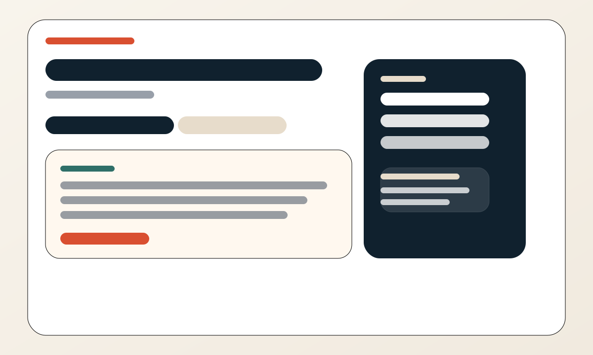

# Document Intelligence Platform

A full-stack Django + React application for scraping book data, storing metadata, generating AI insights, and answering questions through a retrieval-augmented generation pipeline.

## Stack

- Backend: Django REST Framework, Python, MySQL-ready configuration, SQLite fallback for local development
- Vector Store: ChromaDB
- Embeddings: SentenceTransformers
- Automation: Selenium
- AI: LM Studio compatible local LLM endpoint, with optional OpenAI-compatible fallback
- Frontend: React, Vite, Tailwind CSS

## Screenshots

These preview assets are included in `docs/screenshots/` and can be replaced with real captures from the running app when you deploy or demo it.





## Setup

### Backend

1. Create and activate a Python virtual environment.
2. Install dependencies:

```bash
cd backend
c:/Ergosphere/.venv/bin/python.exe -m pip install -r ../requirements.txt
```

3. Create a `.env` file in `backend/` from `.env.example`.
4. Run migrations:

```bash
c:/Ergosphere/.venv/bin/python.exe manage.py migrate
```

5. Start the API server:

```bash
c:/Ergosphere/.venv/bin/python.exe manage.py runserver
```

### Frontend

1. Install frontend dependencies:

```bash
cd frontend
npm install
```

2. Start the app:

```bash
npm run dev
```

3. If the frontend is not using the default backend URL, set:

```bash
VITE_API_BASE_URL=http://localhost:8000
```

## Environment Variables

### Backend

- `DJANGO_SECRET_KEY`
- `DJANGO_DEBUG`
- `DJANGO_ALLOWED_HOSTS`
- `DB_ENGINE` set to `django.db.backends.mysql` for MySQL
- `DB_NAME`
- `DB_USER`
- `DB_PASSWORD`
- `DB_HOST`
- `DB_PORT`
- `LM_STUDIO_BASE_URL` for the local LLM endpoint
- `LM_STUDIO_MODEL` for the model name in LM Studio
- `LLM_PROVIDER` set to `lmstudio` or `openai`
- `OPENAI_API_KEY` if you choose the OpenAI-compatible fallback

### Frontend

- `VITE_API_BASE_URL`

## API Documentation

### Books

- `GET /api/books/` - list all uploaded books
- `GET /api/books/<id>/` - fetch full book details
- `GET /api/books/<id>/related/` - recommend related books
- `POST /api/books/upload-book/` - upload a book from JSON

### RAG

- `POST /ask/` - ask a question over the indexed book corpus

### Example payloads

#### Upload a book

```json
{
  "title": "Clean Code",
  "author": "Robert C. Martin",
  "description": "A handbook of agile software craftsmanship.",
  "rating": "4.80",
  "url": "https://example.com/clean-code"
}
```

#### Ask a question

```json
{
  "question": "What is the main theme of this book?",
  "book_id": 1,
  "top_k": 5
}
```

#### Ask response shape

```json
{
  "answer": "...",
  "source_chunks": [
    {
      "citation_id": 1,
      "chunk_id": "book-1-chunk-0",
      "text": "...",
      "score": 0.91,
      "metadata": {
        "book_id": "1",
        "book_title": "Clean Code"
      }
    }
  ],
  "used_llm": true
}
```

## Sample Questions and Answers

**Question:** What does this book focus on?

**Answer:** The system summarizes the book’s main idea using retrieved chunks from the indexed description and summary, then returns cited source chunks alongside the response.

**Question:** Recommend a similar book.

**Answer:** The recommendation endpoint returns related titles based on embedding similarity and chunk metadata.

## Project Notes

- The backend uses SQLite automatically when `DB_ENGINE` is not set, which keeps local development simple.
- Set `DB_ENGINE=django.db.backends.mysql` in `backend/.env` to use MySQL for metadata.
- RAG answers and book insights are cached to avoid repeated LLM calls.
- The frontend shell is wired for responsive navigation, dashboard listing, book detail, and Q&A.

## Next Steps

- Replace the SVG preview assets with real screenshots after running the frontend.
- Connect the frontend to a running backend instance and verify the full end-to-end flow.
